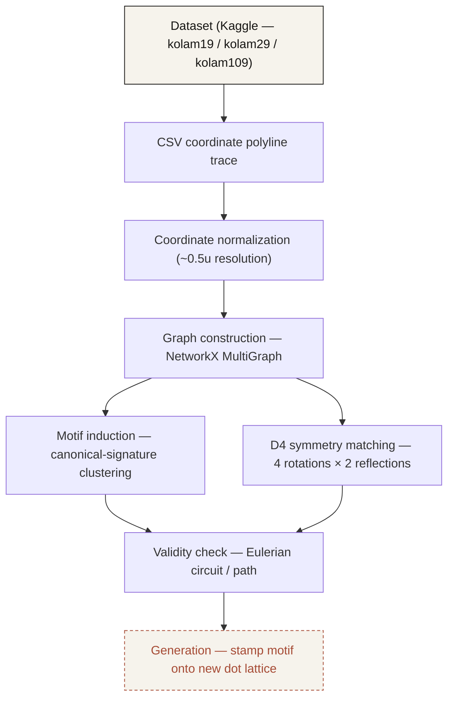

<div align="center">

# PULLI

**Kolam Design-Principle Identification & Recreation**

Computational study of traditional South Indian *Pulli Kolam* patterns — representing hand-drawn one-stroke designs as graphs, measuring their symmetry and motif structure, and validating their single-stroke correctness.

[](https://github.com/Abhishek1106kr/pulli_kolam/actions/workflows/ci.yml)

</div>

---

## Run PULLI locally

```
npm install
npm run dev
```

Frontend:
http://localhost:5173

Backend:
http://localhost:8000

API health:
http://localhost:8000/api/v1/health

This single command starts the FastAPI backend (classical CV + the ML
detector, both served in-process — see `api/detectors.py`) and the
React/Vite frontend together, prefixing each process's output
(`[API]`, `[FRONTEND]`, `[ML]`). It requires Python (with
`pip install -r requirements.txt` already run once) and Node on `PATH`;
see `package.json` for what each `npm run dev:*` script does
individually, and `docs/DEPLOYMENT.md` for production deployment.

---

## What is a Kolam?

A **Pulli Kolam** is a traditional South Indian geometric drawing made by looping a single continuous line around a grid of dots (*pulli*) without lifting the hand. The resulting patterns look intuitive and artistic, but many of them follow strict underlying rules — symmetry, repeated local motifs, and closed single-stroke (Eulerian) continuity.

**PULLI** treats each Kolam as a computational object: a dense coordinate trace that can be turned into a graph, measured, and checked for structural validity.

```
input pattern → infer the minimal generating grammar → prove it's correct → generate
                (motifs / symmetry)                     (validity)          novel variations
                                                                             (generation)
```

---

## Preview

| Home | Explorer (400 patterns) |
|---|---|
|  |  |

| Pattern detail | Pipeline walkthrough |
|---|---|
|  |  |

---

## Computational pipeline



Integer coordinates in a trace correspond to dots actually visited; half-integer coordinates are loop-around geometry where the stroke passes *between* dots. Because a stroke can run alongside a previously drawn strand, edges between the same two nodes can occur more than once — which is why the engine uses a `MultiGraph` rather than a simple graph, and why validity checking has to be multiplicity-aware rather than a plain "is it connected" test.

---

## Repository structure

```
PULLI/
├── engine/                  # Core Python analysis engine
│   ├── graph_io.py          #   CSV trace -> nx.MultiGraph
│   ├── image_io.py          #   Photo/drawing -> nx.MultiGraph (same node/edge format)
│   ├── motifs.py            #   Local-motif induction via canonical-signature clustering
│   ├── symmetry.py          #   D4-symmetry-aware motif matching
│   ├── validity.py          #   Eulerian circuit/path validity checks
│   └── generation.py        #   Stamp an induced motif onto a new dot lattice
│
├── tests/                   # pytest suite (35 tests across 5 modules)
│
├── kolam_data/               # Kaggle "one-stroke-dotted-pulli-kolam" dataset
│   ├── Kolam CSV files/       #   kolam19.csv, kolam29.csv, kolam109.csv
│   ├── Kolam19 Images/        #   400 rendered patterns
│   ├── Kolam29 Images/
│   └── Kolam109 Images/
│
├── frontend/frontend/        # React + Vite web application
│   └── src/
│       ├── pages/             #   Home, Project, HowItWorks, Explore, KolamDetail,
│       │                      #   Analyze, Technology, Impact, About
│       ├── components/        #   Header, Footer, KolamCard, ResearchPipeline, ...
│       └── data/kolams.js     #   Static data layer (400-pattern dataset, replaceable by an API)
│
├── analyze_kolam.py, analyze_symmetry.py, plot_kolam.py, view_kolams.py
│                              # Ad-hoc exploration scripts over the raw CSVs
├── validate_real_data.py, validate_adaptive.py, validate_mdl.py, validate_image_io.py
│                              # Measurement scripts — print real, non-invented numbers
│                              # from running the engine against the dataset
│
├── requirements.txt
└── .github/workflows/ci.yml  # Python tests + frontend lint/build on every push
```

---

## Getting started

### Python engine

```bash
pip install -r requirements.txt
pytest tests/ -v
```

Run a measurement script directly against the dataset, e.g.:

```bash
python validate_real_data.py
```

### Frontend

```bash
cd frontend/frontend
npm install
npm run dev       # local dev server
npm run build     # production build
npm run lint
```

The frontend currently reads from a static data layer (`src/data/kolams.js`) generated from the analysis CSVs, and is structured so that layer can later be swapped for a FastAPI backend without touching the page components.

---

## Dataset

PULLI uses the **[One-Stroke Dotted Pulli Kolam](https://www.kaggle.com/datasets/shubha1011/one-stroke-dotted-pulli-kolam)** dataset from Kaggle, which ships three CSV files — one per grid size:

| Dataset | Patterns | Grid |
|---|---|---|
| `kolam19` | 400 | 37×37 |
| `kolam29` | — | larger lattice |
| `kolam109` | — | larger lattice |

Each row stores a dense polyline trace (`x-kolam {n}` / `y-kolam {n}` columns) sampled on a half-integer grid; every trace is a closed loop (first point equals last point). PULLI does not claim ownership of the dataset — all patterns are attributed to the original dataset maintainers.

---

## Current findings

Measured by running the engine's validation scripts against the real dataset — not invented numbers.

| Method | Avg. edge recall | Avg. motifs / pattern |
|---|---|---|
| Fixed radius (radius = 1, 20-motif cap) | 89.7% | 10.5 |
| Adaptive radius | 99.5% | higher, per-region |

- Evaluated across a 15-pattern sample from `kolam19`.
- Single-motif models explain only a fraction of a real pattern; multi-motif set-cover induction is what gets recall into the 90%+ range.
- The `pytest` suite (35 tests across `test_generation`, `test_image_io`, `test_motifs`, `test_symmetry`, `test_validity`) currently passes in full.

These are experimental results from the current evaluation sample, not universal claims about the dataset or method.

---

## Project status

| Area | Status |
|---|---|
| Dataset integration (kolam19, kolam29, kolam109) | ✅ Done |
| Digital representation (polyline trace parsing) | ✅ Done |
| Graph modelling (NetworkX MultiGraph, edge multiplicity) | ✅ Done |
| Symmetry analysis (D4 group) | ✅ Done |
| Motif analysis (fixed + adaptive radius) | ✅ Done |
| Structural validation (Eulerian constraints) | ✅ Done |
| Computational generation | 🔶 In progress |
| FastAPI backend / live analysis | 🔶 Not yet connected |

---

## Tech stack

**Engine:** Python, NetworkX (`MultiGraph`), Pandas, NumPy, SciPy, scikit-image, OpenCV, Matplotlib
**Frontend:** React 19, Vite, React Router, plain CSS
**Planned:** FastAPI, to connect the frontend to live engine output instead of the static data layer

---

## Acknowledgments

Dataset: [*One-Stroke Dotted Pulli Kolam*](https://www.kaggle.com/datasets/shubha1011/one-stroke-dotted-pulli-kolam) on Kaggle.
