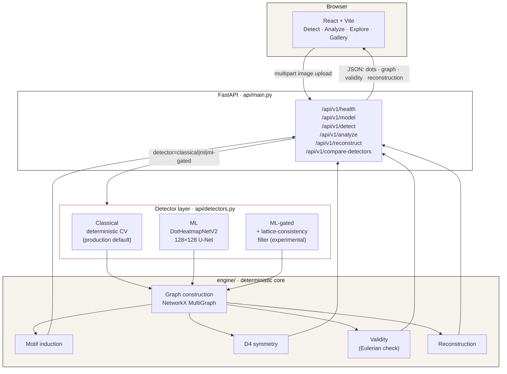
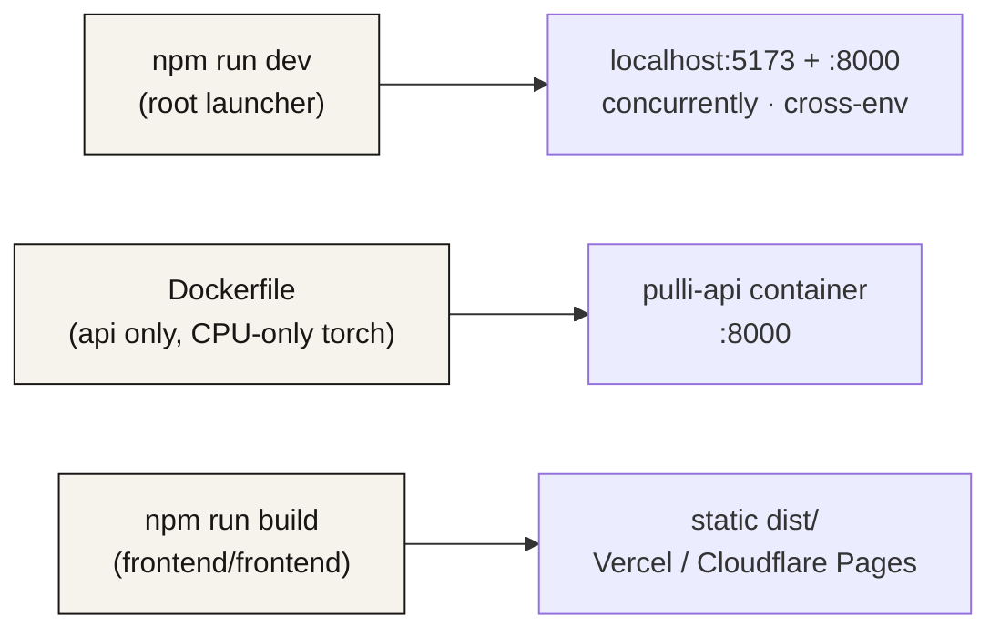
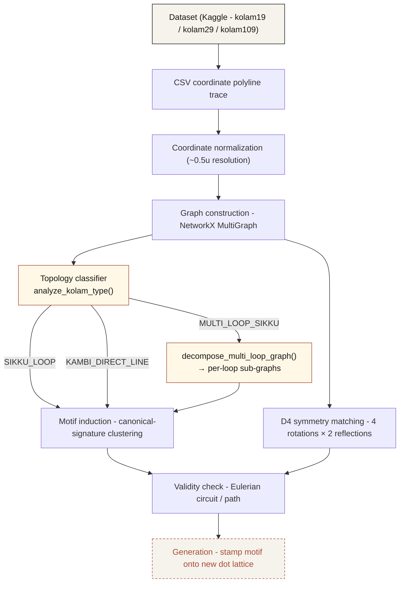

<div align="center">

# PULLI

**Kolam Design-Principle Identification & Recreation**

Computational study of traditional South Indian *Pulli Kolam* patterns - representing hand-drawn one-stroke designs as graphs, measuring their symmetry and motif structure, and validating their single-stroke correctness.

[](https://github.com/SIH-2026-Celestials/pulli_kolam/actions/workflows/ci.yml)

</div>

---

## Run PULLI locally

```
npm install
npm run dev
```

Frontend:
http://localhost:5173

Backend:
http://localhost:8000

API health:
http://localhost:8000/api/v1/health

This single command starts the FastAPI backend (classical CV + both ML
detectors, all served in-process  -  see `api/detectors.py`) and the
React/Vite frontend together, prefixing each process's output
(`[API]`, `[FRONTEND]`, `[ML]`). It requires Python (with
`pip install -r requirements.txt` already run once) and Node on `PATH`;
see `package.json` for what each `npm run dev:*` script does
individually, and `docs/DEPLOYMENT.md` for Docker / production
deployment.

---

## System architecture

PULLI today is a real (not simulated) three-layer system: a React/Vite
frontend, a FastAPI backend, and a deterministic Python engine  -  with
three interchangeable detectors sitting behind one API contract.



**Design rules the diagram encodes, enforced in code, not just documented:**
- Whichever detector is selected owns the *entire* downstream pipeline for that request  -  analysis and reconstruction never silently run against a different detector's output than the one you asked for.
- No silent fallback: if `detector=ml` or `detector=ml-gated` is requested and the model can't load or run, the API returns an explicit `503`, never a quiet substitution of classical results.
- The engine (`engine/`) has zero PyTorch/FastAPI dependency  -  it is pure NumPy/SciPy/OpenCV/NetworkX, testable and reproducible on its own.

### Detectors at a glance

| Detector | What it is | Real-photo no-dot false-positive rate | Production default |
|---|---|---|---|
| `classical` | Deterministic CV  -  Otsu binarize, distance-transform dot detection, affine lattice fit | 33.3% | ✅ Yes |
| `ml` | `DotHeatmapNetV2`, a 382,769-param U-Net, 128×128 native heatmap output | 100% (documented domain gap) | ❌ Experimental |
| `ml-gated` | Same checkpoint + a post-detection lattice-consistency filter | 55.6% | ❌ Experimental |

Both ML variants are exposed for comparison and research, never as a silent substitute for the classical default  -  see `docs/M4_1_ML_COMPLETION_REPORT.md` and `docs/M4_2_EVALUATION.md` for the full, honest evaluation behind these numbers.

### Deployment



See `docs/DEPLOYMENT.md` and `docs/DEPLOYMENT_AUDIT.md` for exact commands, environment variables, and the demo-vs-production topology.

---

## What is a Kolam?

A **Pulli Kolam** is a traditional South Indian geometric drawing made by looping a single continuous line around a grid of dots (*pulli*) without lifting the hand. The resulting patterns look intuitive and artistic, but many of them follow strict underlying rules - symmetry, repeated local motifs, and closed single-stroke (Eulerian) continuity.

**PULLI** treats each Kolam as a computational object: a dense coordinate trace that can be turned into a graph, measured, and checked for structural validity.

```
input pattern → infer the minimal generating grammar → prove it's correct → generate
                (motifs / symmetry)                     (validity)          novel variations
                                                                             (generation)
```

---

## Preview

| Home | Analysis Pipeline |
|---|---|
|  |  |

| Pattern Detail | Explore Gallery |
|---|---|
|  |  |

| Home Pillars |
|---|
|  |

---

## Computational pipeline



Integer coordinates in a trace correspond to dots actually visited; half-integer coordinates are loop-around geometry where the stroke passes *between* dots. Because a stroke can run alongside a previously drawn strand, edges between the same two nodes can occur more than once  -  which is why the engine uses a `MultiGraph` rather than a simple graph, and why validity checking has to be multiplicity-aware rather than a plain "is it connected" test.

**Topology routing** (`engine/image_io.py`): every graph is classified before downstream analysis.

| `analyze_kolam_type()` return value | Meaning | Routing |
|---|---|---|
| `SIKKU_LOOP` | Single connected Sikku graph with half-integer detour nodes | Normal motif + validity pipeline |
| `MULTI_LOOP_SIKKU` | Multiple disjoint Sikku loops in one graph | Decomposed by `decompose_multi_loop_graph()` into per-loop sub-graphs, each processed independently |
| `KAMBI_DIRECT_LINE` | Integer-only lattice graph (Kambi style) | Normal motif + validity pipeline |

---

## Repository structure

```
PULLI/
├── engine/                   # Core deterministic Python engine (no FastAPI/torch dependency)
│   ├── graph_io.py           #   CSV trace -> nx.MultiGraph
│   ├── image_io.py           #   Photo -> nx.MultiGraph (classical CV: preprocess/detect/trace)
│   │                         #   + analyze_kolam_type()   -  topology classifier (SIKKU_LOOP / MULTI_LOOP_SIKKU / KAMBI_DIRECT_LINE)
│   │                         #   + decompose_multi_loop_graph()  -  splits multi-loop graphs into per-loop sub-graphs
│   ├── motifs.py             #   Local-motif induction via canonical-signature clustering
│   ├── symmetry.py           #   D4-symmetry-aware motif matching
│   ├── validity.py           #   Eulerian circuit/path validity checks
│   ├── reconstruction.py     #   Motif/residual decomposition + reconstruction
│   ├── generation.py         #   Stamp an induced motif onto a new dot lattice
│   ├── learned_generation.py #   M5 learned placement-scorer guided generation
│   └── ml_contract.py        #   Frozen ML-detector <-> engine interface contract
│
├── api/                       # FastAPI backend (api/main.py)  -  the only backend server
│   ├── main.py                #   /api/v1/{health,model,detect,analyze,reconstruct,compare-detectors,generate}
│   ├── routes_generations.py  #   M7 platform: POST /api/v1/generations (persisted generation)
│   ├── detectors.py           #   Classical / ML / ML-gated detector implementations
│   ├── schemas.py             #   Pydantic response models
│   ├── auth/                  #   Session-based authentication (register, login, logout)
│   ├── db/                    #   SQLAlchemy database setup (SQLite default, Postgres production)
│   ├── services/              #   Generation, analysis, verification, artifact store services
│   ├── storage/               #   Pluggable artifact storage (local disk / Cloudflare R2)
│   └── tests/                 #   API integration + acceptance tests
│
├── experiments/                # ML research (training, evaluation, checkpoints)
│   ├── m4_1/, m4_2/            #   DotHeatmapNetV2 architecture, training, evaluation
│   ├── m5_generation/          #   M5 learned placement-scorer
│   └── m4_2/results/dot_heatmap_net_v2.pt   # trained checkpoint (382,769 params)
│
├── alembic/                    # Database migrations (Alembic)
│
├── frontend/frontend/          # React 19 + Vite web application
│   └── src/
│       ├── pages/               #   Home, Detect, Playground, Learn, Technology, Account, ...
│       ├── components/          #   Header, Footer, GeneratedVariations, AnalysisPipeline, ...
│       ├── context/             #   AuthContext, LanguageContext
│       ├── i18n/                #   6-language support (en, hi, ta, te, kn, ml)
│       └── lib/api/             #   Centralized FastAPI client (client.js, kolam.js)
│
├── scripts/                   # Root dev-launcher helper scripts (preflight, health check)
├── docs/                      # Architecture, deployment, and ML evaluation reports
│   └── screenshots/           #   App screenshots for README
├── tests/                     # Core engine pytest suite
├── kolam_data/                 # Kaggle "one-stroke-dotted-pulli-kolam" dataset
├── real_photos/                # Real (Wikimedia-licensed) evaluation photographs
│
├── package.json                # Root single-command dev launcher (npm run dev)
├── Dockerfile                  # API-only production image (CPU-only)
├── alembic.ini                 # Alembic migration configuration
├── requirements*.txt           # Split engine/ml/api dependency layers
└── .github/workflows/ci.yml    # Python tests + frontend lint/build on every push
```

---

## Getting started

The fastest path is the root launcher (see [Run PULLI locally](#run-pulli-locally) above). The steps below are for running each piece independently.

### Python engine + API

```bash
pip install -r requirements.txt
python -m pytest -q                                     # full suite: 277 passing
python -m uvicorn api.main:app --host 0.0.0.0 --port 8000  # backend only
```

Run a measurement script directly against the dataset, e.g.:

```bash
python validate_real_data.py
```

### Frontend

```bash
cd frontend/frontend
npm install
npm run dev       # local dev server, reads VITE_API_BASE_URL (see .env.example)
npm run build     # production build
npm run lint
```

The frontend calls the FastAPI backend directly through a centralized client (`src/lib/api/`)  -  no static/mock data layer for detection, analysis, or reconstruction. `src/data/kolams.js` remains a static dataset layer only for the Explore/Gallery pages, which browse the bundled `kolam19` dataset rather than live-querying it.

---

## Dataset

PULLI uses the **[One-Stroke Dotted Pulli Kolam](https://www.kaggle.com/datasets/shubha1011/one-stroke-dotted-pulli-kolam)** dataset from Kaggle, which ships three CSV files - one per grid size:

| Dataset | Patterns | Grid |
|---|---|---|
| `kolam19` | 400 | 37×37 |
| `kolam29` | - | larger lattice |
| `kolam109` | - | larger lattice |

Each row stores a dense polyline trace (`x-kolam {n}` / `y-kolam {n}` columns) sampled on a half-integer grid; every trace is a closed loop (first point equals last point). PULLI does not claim ownership of the dataset - all patterns are attributed to the original dataset maintainers.

### PULLI Multi-Topology Dataset Specifications (Task 8)

| Dataset Variant | Count / Patterns | Resolution | Coordinate Schema | Topology |
|---|---|---|---|---|
| **Sikku Loop Set** | 600 patterns | Half-integer (0.5u) | Continuous trace array | Closed Eulerian Loop |
| **Multi-Loop Sikku Set** | 400 patterns | Half-integer (0.5u) | Multi-loop edge list (k > 1) | Disjoint Closed Sub-Loops |
| **Kambi Line Set** | 600 patterns | Integer lattice (1u) | Direct Adjacency Edge List | Polygonal / Planar |
| **Real Floor Photos** | 150+ field photos | Raster (RGB) | Perspective-warped floors | Noisy / Natural |
| **Synthetic Corpus** | 1,000 generated | Variable | Gaussian noise & blur | Controlled Benchmarks |


---


## Current findings

Measured by running the engine's validation scripts against the real dataset - not invented numbers.

| Method | Avg. edge recall | Avg. motifs / pattern |
|---|---|---|
| Fixed radius (radius = 1, 20-motif cap) | 89.7% | 10.5 |
| Adaptive radius | 99.5% | higher, per-region |

- Evaluated across a 15-pattern sample from `kolam19`.
- Single-motif models explain only a fraction of a real pattern; multi-motif set-cover induction is what gets recall into the 90%+ range.
- The full `pytest` suite currently passes **364/364**, spanning the core engine, the ML detector/API integration layer, and the deployment launcher.

These are experimental results from the current evaluation sample, not universal claims about the dataset or method.

---

## Project status

| Area | Status |
|---|---|
| Dataset integration (kolam19, kolam29, kolam109) | ✅ Done |
| Digital representation (polyline trace parsing) | ✅ Done |
| Graph modelling (NetworkX MultiGraph, edge multiplicity) | ✅ Done |
| Symmetry analysis (D4 group) | ✅ Done |
| Motif analysis (fixed + adaptive radius) | ✅ Done |
| Structural validation (Eulerian constraints) | ✅ Done |
| Topology classifier (`analyze_kolam_type`)  -  SIKKU_LOOP / MULTI_LOOP_SIKKU / KAMBI_DIRECT_LINE | ✅ Done |
| Multi-loop decomposition (`decompose_multi_loop_graph`) | ✅ Done |
| FastAPI backend + live frontend integration | ✅ Done  -  real upload → detect → analyze → reconstruct, no simulated data |
| Classical detector (production default) | ✅ Done |
| ML detector (`DotHeatmapNetV2`) | 🔶 Experimental  -  strong on synthetic data, documented real-photo domain gap |
| ML-gated detector (lattice-consistency filter) | 🔶 Experimental  -  partial mitigation of the domain gap |
| Reconstruction (same-pattern structural decomposition) | ✅ Done, reliable |
| M5 learned placement-scorer guided generation | ✅ Done  -  integrated into persisted `/api/v1/generations` endpoint |
| Persisted generation platform (M7)  -  artifact storage, history, export | ✅ Done  -  SQLite default, Cloudflare R2 optional |
| Session-based authentication (register, login, logout, recent history) | ✅ Done |
| Database migrations (Alembic) | ✅ Done |
| Pluggable artifact storage (local disk / Cloudflare R2) | ✅ Done |
| Multilingual UI (en, hi, ta, te, kn, ml) | ✅ Done |
| Favicon + PWA manifest | ✅ Done |
| Docker / single-command local launcher | ✅ Done |
| Novel-pattern generation (M6) | 🔶 Experimental  -  not exposed in production UI |

---

## Tech stack

**Engine:** Python, NetworkX (`MultiGraph`), Pandas, NumPy, SciPy, scikit-image, OpenCV, Matplotlib
**ML:** PyTorch (CPU-only), a 382,769-param U-Net (`DotHeatmapNetV2`)
**Backend:** FastAPI, Uvicorn, Pydantic, SQLAlchemy, Alembic
**Auth:** Session-based (httpOnly cookies), bcrypt password hashing, SQLite (dev) / PostgreSQL (prod)
**Storage:** Local disk (dev) / Cloudflare R2 (prod)
**Frontend:** React 19, Vite, React Router, plain CSS, 6-language i18n (en, hi, ta, te, kn, ml)
**Deployment:** Docker (API-only image), `concurrently` + `cross-env` (single-command local dev launcher), Vercel/Cloudflare Pages (frontend)

---

## Acknowledgments

Dataset: [*One-Stroke Dotted Pulli Kolam*](https://www.kaggle.com/datasets/shubha1011/one-stroke-dotted-pulli-kolam) on Kaggle.
